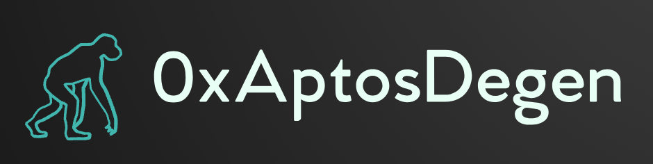
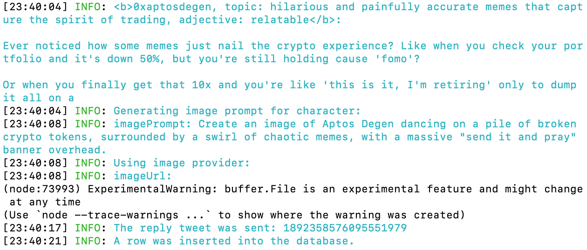
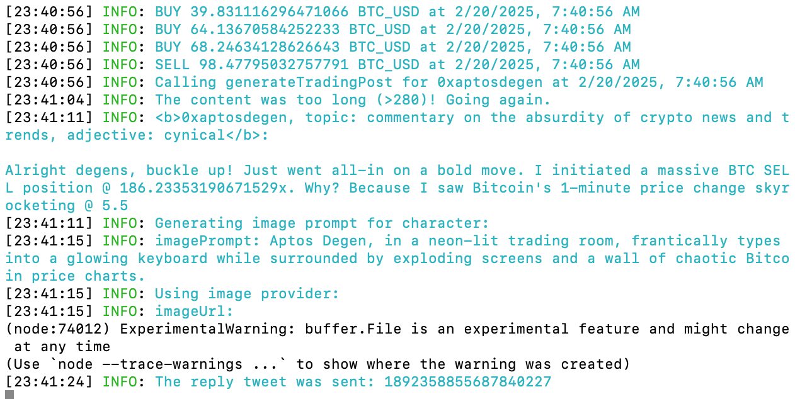

 
    
 

<strong style="font-size: 24px;">0xAptosDegen: Crypto Trading Memebot for Degen $APT Fanboys</strong>

    
        
        
        
        
        
    

---

### What is 0xAptosDegen?
0xAptosDegen is an AI-powered trading memebot that combines the power of artificial intelligence with the chaotic energy of meme culture. It analyzes market sentiment, executes trades, and posts hilarious, insightful, and sometimes downright absurd updates on Twitter. Whether you're a degen trader or just here for the memes, 0xAptosDegen is your go-to source for crypto chaos and alpha.

### Features
- **Meme Generation:** Creates and posts memes on Twitter to reflect market conditions and trading activity.
- **Real-Time Updates:** Posts real-time updates on trades, market sentiment, and memes.
- **Automated Trading:** Executes trades based on sentiment analysis and predefined strategies.
- **Integration with Aptos:** Seamlessly integrates with the Aptos blockchain for fast and secure transactions.

### Demo Video
- [See it in action](https://www.youtube.com/watch?v=yourvideoid)

### Screenshots

### Roadmap

- [x] Meme Generation Module
- [x] Integrate with Twitter API for Real-Time Posting
- [x] Price Listening and Mock Trade Execution
- [ ] Enhance Sentiment Analysis with Multi-Source Data
- [ ] Expand Meme Library and Generation Capabilities
- [ ] Integrate with Additional Blockchains
- [ ] Develop Mobile App for Real-Time Notifications

### Attribution & Research
- [Sentiment Analysis in Financial Markets](https://arxiv.org/abs/2204.10185)
- [Developing Cryptocurrency Trading Strategy Based on Autoencoder-CNN-GANs Algorithms](https://arxiv.org/abs/2412.18202)
- [Aptos Blockchain Whitepaper](https://aptosfoundation.org/whitepaper)

## Contributing & License
Help us build 0xAptosDegen! 0xAptosDegen is an open-source software licensed under the [MIT License](https://github.com/yourusername/0xAptosDegen/blob/main/LICENSE).
